# 🚀 AWS EC2 Static Website Hosting

<p align="center">


</p>

---

# 📖 Project Overview

This project demonstrates how to deploy a static HTML website on an **Amazon EC2** instance using **Amazon Linux 2023** and **Apache HTTP Server**.

The project includes:

- Launching an EC2 Instance
- Configuring Security Groups
- Connecting via SSH
- Installing Apache HTTP Server
- Deploying a Static Website
- Managing Source Code using Git & GitHub

---

# ✨ Features

- ✅ Amazon EC2 Deployment
- ✅ Apache Web Server
- ✅ Linux Administration
- ✅ SSH Access
- ✅ Static Website Hosting
- ✅ Git Version Control
- ✅ GitHub Repository

---

# 🛠 Technologies Used

- Amazon EC2
- Amazon Linux 2023
- Apache HTTP Server
- HTML5
- Linux
- Git
- GitHub
- SSH

---

# 🏗 Architecture

```text
              User
                │
         Web Browser
                │
         Public IPv4 Address
                │
      Amazon EC2 (t3.micro)
      Amazon Linux 2023
                │
      Apache HTTP Server
                │
        /var/www/html
                │
           index.html
```

---

# 📂 Project Structure

```text
aws-ec2-web-server-project
│
├── index.html
├── README.md
└── screenshots
    ├── ec2-dashboard.png
    ├── launch-instance.png
    ├── key-pair.png
    ├── security-group.png
    ├── ec2-running.png
    ├── ssh-connect.png
    ├── ssh-login.png
    ├── system-update.png
    ├── apache-running.png
    ├── website-output.png
    └── github-repository.png
```

---

# ⚙️ Deployment Steps

### 1. Launch EC2 Instance

- Amazon Linux 2023
- t3.micro
- Create/Select Key Pair

### 2. Configure Security Group

Allow the following ports:

- SSH (22)
- HTTP (80)

### 3. Connect via SSH

```bash
ssh -i "ronak-key.pem" ec2-user@<Public-IP>
```

### 4. Update the System

```bash
sudo dnf update -y
```

### 5. Install Apache

```bash
sudo dnf install httpd -y
```

### 6. Enable & Start Apache

```bash
sudo systemctl enable httpd
sudo systemctl start httpd
```

### 7. Deploy Website

```bash
sudo cp index.html /var/www/html/
```

---

# 💻 Commands Used

```bash
sudo dnf update -y
sudo dnf install httpd -y
sudo systemctl enable httpd
sudo systemctl start httpd
sudo systemctl status httpd
sudo cp index.html /var/www/html/
```

---

# 📸 Project Screenshots

## AWS EC2 Dashboard

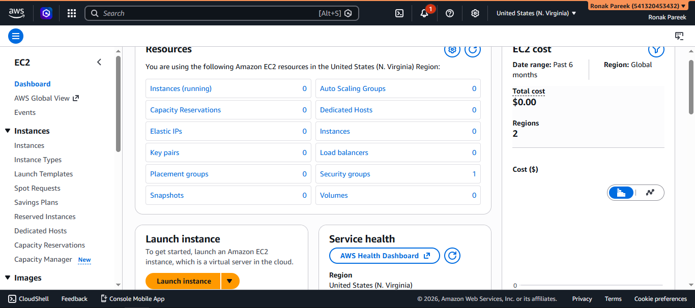

---

## Launch Instance

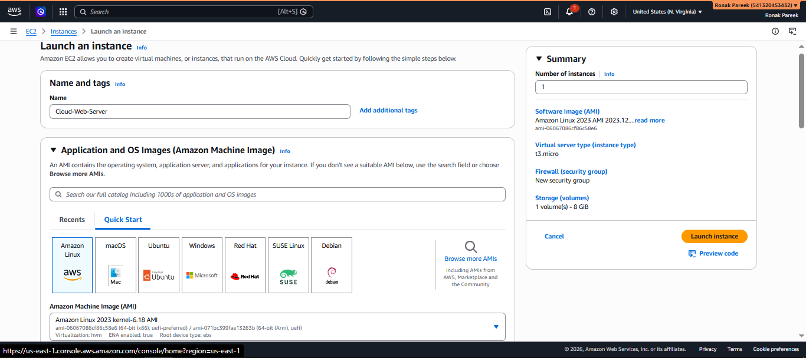

---

## Key Pair Configuration

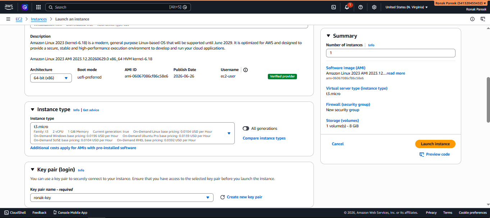

---

## Security Group Configuration

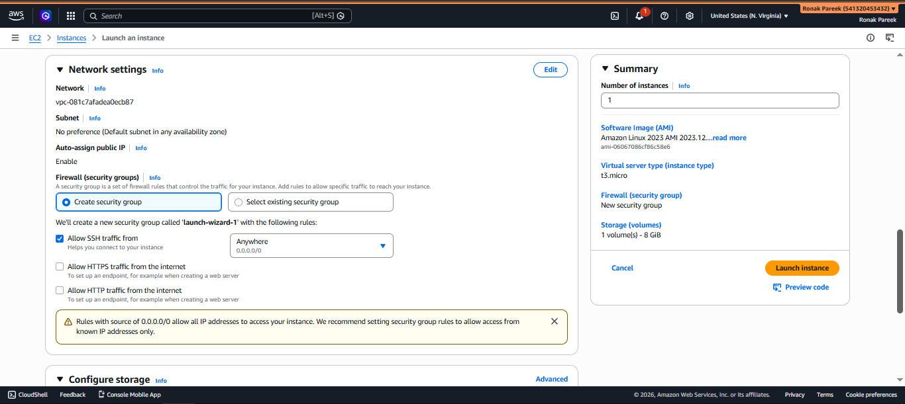

---

## EC2 Running

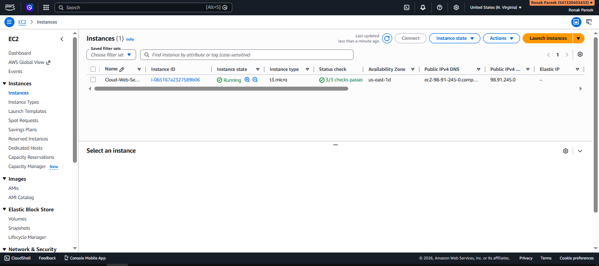

---

## SSH Connection

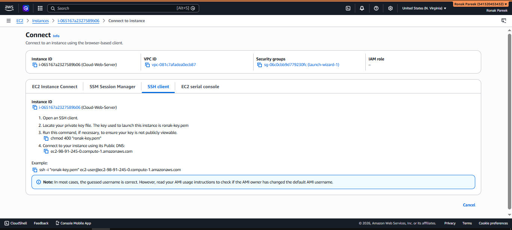

---

## SSH Login

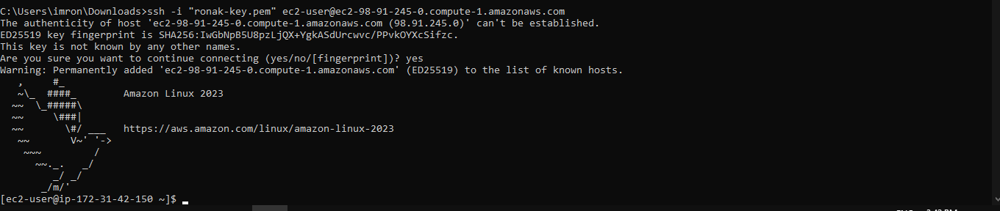

---

## System Update

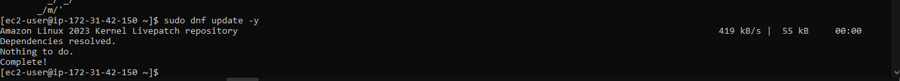

---

## Apache Running

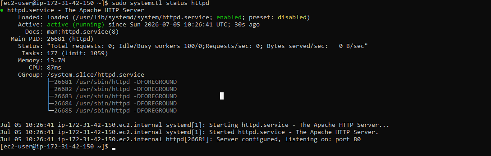

---

## Live Website

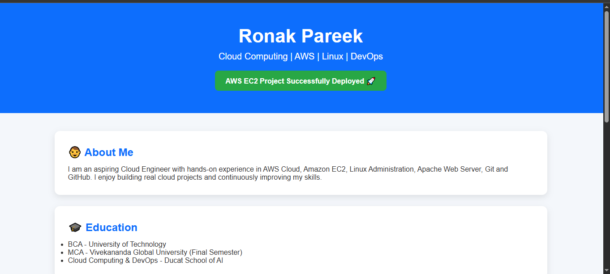

---

## GitHub Repository

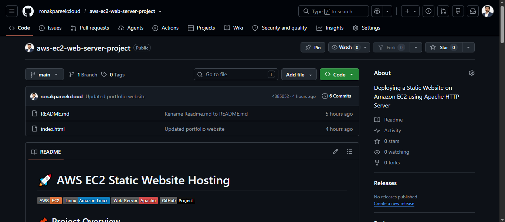

---

# 🎯 Skills Demonstrated

- Amazon EC2
- Linux Administration
- Apache HTTP Server
- SSH
- Git
- GitHub
- Static Website Hosting

---

# 📚 Learning Outcomes

Through this project I learned how to:

- Deploy a website on AWS EC2
- Configure Security Groups
- Connect using SSH
- Install and manage Apache HTTP Server
- Host a Static Website
- Manage projects using Git & GitHub

---

# 🚀 Future Improvements

- HTTPS (SSL)
- Route 53 Custom Domain
- Elastic Load Balancer
- Auto Scaling
- Docker Deployment
- CI/CD Pipeline

---

# 👨‍💻 Author

**Ronak Pareek**

Cloud Computing | AWS | Linux | DevOps

📧 Email: ronakpareekcloud@gmail.com

🌐 GitHub: https://github.com/ronakpareekcloud

---

⭐ If you found this project useful, please consider giving it a Star.
